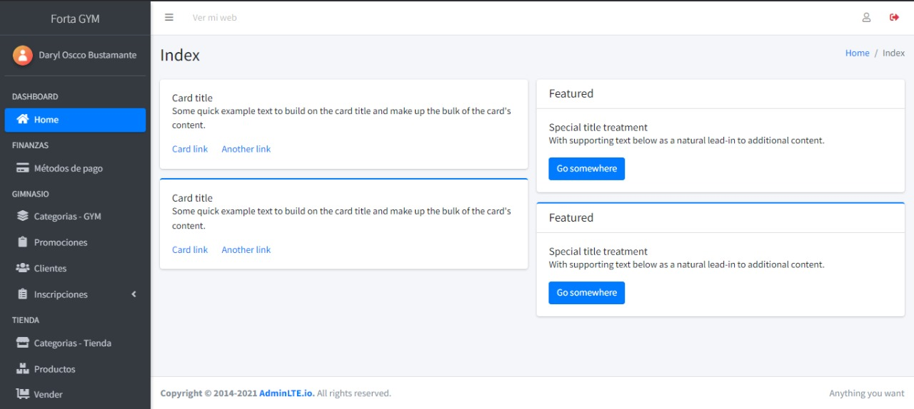

# Proyecto Laravel 10 con AdminLTE3

## Descripción del Proyecto

Este proyecto integra el potente framework **Laravel 10** con la plantilla de administración **AdminLTE3** para crear un entorno de trabajo moderno y profesional. La combinación permite desarrollar aplicaciones web con una interfaz de usuario intuitiva y altamente personalizable.

## Características Principales

- **Laravel 10**: Un framework PHP moderno con herramientas avanzadas para desarrollo web.
- **AdminLTE3**: Una plantilla de administración basada en Bootstrap 4 con un diseño responsivo y elegante.
- **Autenticación y Roles**: Implementación de autenticación básica y sistema de roles (si corresponde).
- **Fácil Configuración**: Integración simplificada de AdminLTE con los assets necesarios.
- **Diseño Responsivo**: Compatible con dispositivos móviles y escritorio.

## Capturas de Pantalla

<p align="center">
  
</p>

## Requisitos Previos

Asegúrate de tener instalados los siguientes programas:

- **PHP 8.1 o superior**
- **Composer**
- **MySQL o cualquier base de datos compatible con Laravel**
- **Node.js y NPM**

## Instalación

Sigue estos pasos para configurar el proyecto en tu entorno local:

1. Clona este repositorio:

   ```bash
   git clone https://github.com/ArathoDev/AdminLTE-3-administrative-system-template-integrated-into-Laravel.git
   ```

2. Navega al directorio del proyecto:

   ```bash
   cd AdminLTE-3-administrative-system-template-integrated-into-Laravel
   ```

3. Instala las dependencias de PHP:

   ```bash
   composer install
   ```

4. Instala las dependencias de Node.js:

   ```bash
   npm install && npm run dev
   ```

5. Configura tu archivo `.env`:

   ```bash
   cp .env.example .env
   ```
   Edita las variables necesarias como la conexión a tu base de datos.

6. Genera la clave de la aplicación:

   ```bash
   php artisan key:generate
   ```

7. Inicia el servidor de desarrollo:

   ```bash
   php artisan serve
   ```

Ahora puedes acceder a la aplicación en `http://127.0.0.1:8000`.

## Estructura del Proyecto

- **Resources/views/layout**: Contiene los archivos principales de AdminLTE.
- **Public/**: Carpeta donde se encuentran los assets compilados de AdminLTE.
- **Routes/web.php**: Definición de las rutas principales del proyecto.

## Personalización de AdminLTE

Para modificar la plantilla AdminLTE, puedes editar los archivos en `resources/views/layout`

<p align="center">
  Hecho con <span style="color: red;">&hearts;</span> usando Laravel y AdminLTE3.
</p>

